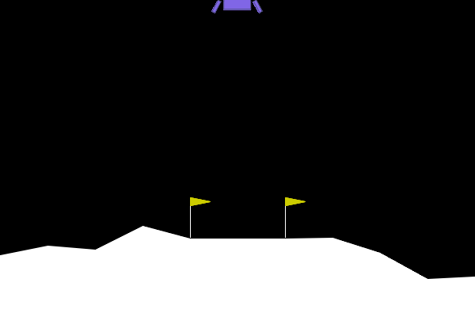
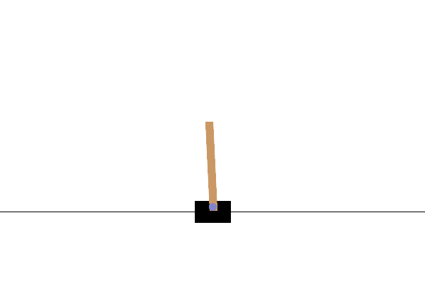

# Reinforcement-Learning-course
This repository contains an introductory course to Reinforcement Learning (RL) with hands-on classic examples of agents trained on gym environments. We start with Dynamic Programming algorithms: Value Iteration, Q-Iteration and Policy Iteration which we use to train an agent on the FrozenLake environment, then we we move on to Q-Learning and the cartpole environment; for Deep RL, we implement DQN and train an agent on the LunarLander environment. I will provide notes explaining the motivations, details, advantages and limitations of each method, along with documented python scripts, for Deep RL, I will be using pytorch. This is an ongoing project and I will include many more algorithms such as Reinforce and Actor-Critic variants...

<p align="center">



</p>

## Dynamic Programming

Use file ```frozen_lake.py``` to train a Dynamic Programming agent on the FrozenLake environment, argument ```algorithm``` specifies which algorithm to use between ```value_iteration```, ```q_iteration``` and ```policy_oteration```. Example:
```
cd dynamic-programming
python frozen_lake.py --map_name 4x4 --algorithm policy_iteration
```

## Q-Learning

Use file ```cartpole.py``` to train a Q-Learning agent on the cartpole environment, arguments ```n_bins``` and ```n_initialise``` are very important as they initialise the bins that will be used to discretise the state space. Example:
```
cd q-learning
python cartpole.py --n_train 20000
```

## DQN

Use file ```lunar_lander.py``` to train a DQN agent on the LunarLander environment. Example:
```
cd dqn
python lunar_lander.py --n_train 1000
```

For Q-Learning and DQN, there is an argument ```log_dir``` that specifies the name of a folder where tensorboard events will be stored. To use tensorboard, let us suppose that we specified ```--log_dir runs_agent```, then we can track the evolution of some variables during training by entering:
```
tensorboard --logdir runs_agent
```
A message will then be displayed to describe how to open the localhost to visualise the tracked variables.

