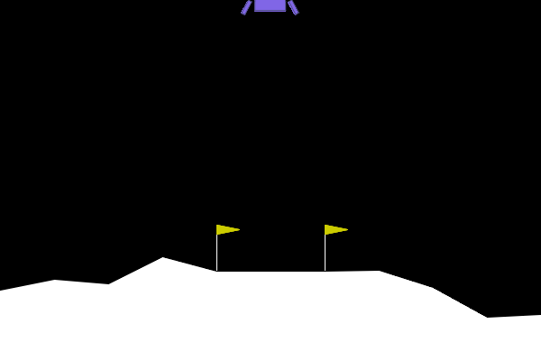
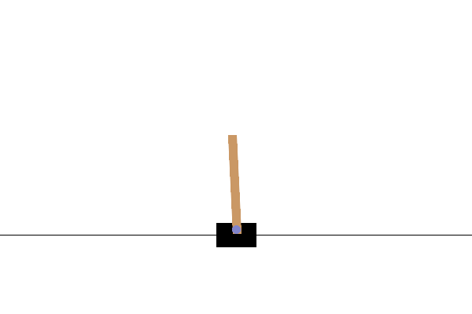
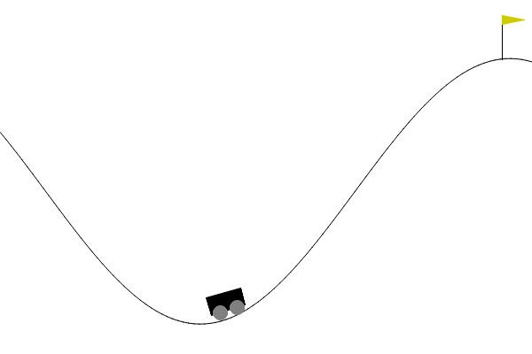
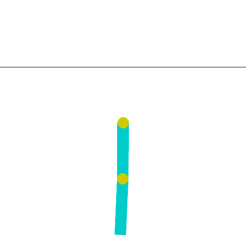

# Reinforcement Learning Course

This is an ongoing project meant as an educational exploration of classic and deep Reinforcement Learning (RL) algorithms, from dynamic programming to tabular methods and modern policy gradient approaches. Each algorithm is implemented from scratch and demonstrated on [Gymnasium](https://arxiv.org/abs/2407.17032) environments.

<p align="center">






</p>

---

## About

This project is designed as a hands-on introduction to Reinforcement Learning. It covers a broad range of algorithms organized by family, each paired with concrete examples on classic control and navigation tasks. The goal is to provide clean, readable implementations that closely follow the original papers and textbooks, making it straightforward to study the mechanics of each method.

### Algorithms implemented

| Family | Algorithms |
|---|---|
| **Heuristics** | A\* Search |
| **Dynamic Programming** | Value Iteration, Q-Iteration, Policy Iteration |
| **Monte Carlo** | First-visit and Every-visit Monte Carlo Control |
| **Temporal Difference** | SARSA, Expected SARSA, Q-Learning, Double Q-Learning |
| **Deep RL — Policy Gradient** | REINFORCE, REINFORCE with Baseline |
| **Deep RL — Actor-Critic** | Actor-Critic (online), A2C with normalized advantages |
| **Deep RL — Value-Based** | DQN, Double DQN |
| **Deep RL — Clipped Surrogate** | PPO (multi-worker, with GAE and mini-batch updates) |

### Environments

Agents are trained and evaluated on standard [Gymnasium](https://gymnasium.farama.org/) environments:

- **Discrete grid worlds**: FrozenLake, CliffWalking, Taxi
- **Classic control**: CartPole, MountainCar, Acrobot
- **Continuous observation / discrete action**: LunarLander
- **Card game**: Blackjack

---

## Installation

```bash
git clone https://github.com/Chaoukia/Reinforcement-Learning-course.git
cd Reinforcement-Learning-course
pip install -e .
```

---

## Usage

All examples follow the same pattern: train an agent, render a test run in the environment, and optionally save a GIF. Scripts live under `src/reinforcement_learning_course/<algorithm_family>/examples/`.

Every script exposes `--n_test` (number of test episodes) and `--path_gif` (save a GIF of the trained agent) arguments. Pass `--help` to any script to see all available options.

---

## Examples

### PPO — LunarLander

Trains a multi-worker PPO agent on `LunarLander-v3`. Workers share the actor and critic networks and synchronize gradient updates via a barrier. GAE is used to estimate advantages, which are normalized across workers before each mini-batch update.

```bash
python src/reinforcement_learning_course/deep_rl/ppo/examples/lunar_lander.py \
    --n_workers 12 \
    --t_max 1024 \
    --n_train 10000 \
    --epochs 4 \
    --batch_size 64 \
    --epsilon 0.2 \
    --lambd 0.98 \
    --gamma 0.999 \
    --lr_actor 3e-4 \
    --lr_critic 3e-4 \
    --alpha_entropy 0.01 \
    --thresh 250 \
    --log_dir runs/ppo_lunarlander \
    --path_gif gifs/ppo_lunarlander.gif
```

Key arguments:

| Argument | Default | Description |
|---|---|---|
| `--n_workers` | 12 | Number of parallel worker processes |
| `--t_max` | 1024 | Environment steps collected per iteration per worker |
| `--epochs` | 4 | PPO optimization epochs per collected batch |
| `--batch_size` | 64 | Mini-batch size for gradient updates |
| `--epsilon` | 0.2 | PPO clipping parameter |
| `--lambd` | 0.98 | GAE lambda for advantage estimation |
| `--thresh` | 250 | Mean return threshold for early stopping |

---

### DQN — CartPole

Trains a Deep Q-Network agent on `CartPole-v1` with experience replay and a target network. Pass `--double_learning yes` to switch to Double DQN, which reduces overestimation bias by decoupling action selection from value estimation.

```bash
python src/reinforcement_learning_course/deep_rl/dqn/examples/cartpole.py \
    --n_train 10000 \
    --n_pretrain 64 \
    --epsilon_start 1.0 \
    --epsilon_stop 0.1 \
    --decay_rate 5e-6 \
    --n_learn 10 \
    --tau 50 \
    --batch_size 64 \
    --lr 1e-4 \
    --gamma 0.99 \
    --thresh 400 \
    --log_dir runs/dqn_cartpole \
    --double_learning no \
    --path_gif gifs/dqn_cartpole.gif
```

Key arguments:

| Argument | Default | Description |
|---|---|---|
| `--n_pretrain` | 64 | Episodes of random play to pre-fill the replay buffer |
| `--n_learn` | 10 | Steps between consecutive Q-network updates |
| `--tau` | 50 | Steps between consecutive target network syncs |
| `--double_learning` | `no` | Use Double DQN (`yes` / `no`) |
| `--thresh` | 400 | Mean return threshold for early stopping |

---

### Q-Learning — Taxi

Trains a tabular Q-Learning agent on `Taxi-v3`. The `--algorithm` flag selects between `sarsa`, `expected_sarsa`, `q_learning`, and `double_q_learning`.

```bash
python src/reinforcement_learning_course/temporal_difference/examples/taxi.py \
    --algorithm q_learning \
    --alpha 0.1
    --n_train 100000 \
    --epsilon_start 1.0 \
    --epsilon_stop 0.1 \
    --decay_rate 1e-4 \
    --gamma 0.99 \
    --print_iter 1000 \
    --n_test 5 \
    --verbose yes \
    --path_gif gifs/qlearning_taxi.gif
```

Key arguments:

| Argument | Default | Description |
|---|---|---|
| `--algorithm` | `q_learning` | TD algorithm: `sarsa`, `expected_sarsa`, `q_learning`, `double_q_learning` |
| `--alpha` | 0.1 | Fixed learning rate (omit to use 1/n visit schedule) |
| `--epsilon_start` | 1.0 | Initial exploration rate |
| `--epsilon_stop` | 0.1 | Final exploration rate |
| `--decay_rate` | 1e-4 | Exponential decay rate for epsilon |

---

## More examples

### Dynamic Programming (Policy Iteration) — FrozenLake

```bash
python src/reinforcement_learning_course/dynamic_programming/examples/frozen_lake.py \
    --map_name 4x4 \
    --algorithm policy_iteration \
    --gamma 0.99
```

### Monte Carlo (Every visit) — FrozenLake

```bash
python src/reinforcement_learning_course/monte_carlo/examples/frozen_lake.py \
    --map_name 4x4 \
    --is_slippery yes \
    --first_visit no \
    --n_train 100000 \
    --epsilon_start 1.0 \
    --epsilon_stop 0.1 \
    --decay_rate 1e-4
```

### A* Search — FrozenLake

```bash
python src/reinforcement_learning_course/heuristics/examples/frozen_lake.py \
    --map_name 4x4
```

### Actor-Critic — CartPole

```bash
python src/reinforcement_learning_course/deep_rl/actor_critic/examples/lunar_lander.py \
    --n_train 10000 \
    --t_max 5 \
    --lr_policy 1e-4 \
    --lr_value 1e-4 \
    --alpha_entropy 0.0 \
    --thresh 400
    --log_dir runs/actor_critic_cartpole
```

---

## TensorBoard

All deep RL scripts log losses and returns to TensorBoard. Launch the dashboard with:

```bash
tensorboard --logdir runs/
```

---

## References

- Sutton, R. S., & Barto, A. G. (2018). *Reinforcement Learning: An Introduction* (2nd ed.). MIT Press.
- Mnih, V., et al. (2015). [Human-level control through deep reinforcement learning](https://www.nature.com/articles/nature14236). *Nature*.
- van Hasselt, H., Guez, A., & Silver, D. (2016). [Deep reinforcement learning with double Q-learning](https://arxiv.org/abs/1509.06461). *AAAI*.
- Williams, R. J. (1992). [Simple statistical gradient-following algorithms for connectionist reinforcement learning](https://link.springer.com/article/10.1007/BF00992696). *Machine Learning*.
- Mnih, V., et al. (2016). [Asynchronous methods for deep reinforcement learning](https://arxiv.org/abs/1602.01783). *ICML*.
- Schulman, J., et al. (2017). [Proximal policy optimization algorithms](https://arxiv.org/abs/1707.06347). *arXiv*.
- Schulman, J., et al. (2015). [High-dimensional continuous control using generalized advantage estimation](https://arxiv.org/abs/1506.02438). *ICLR*.
