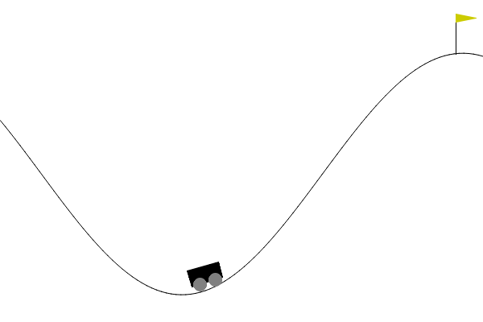
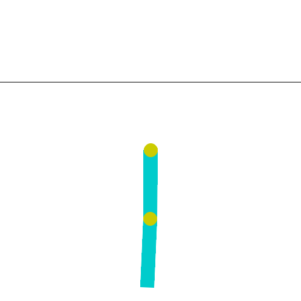

# Reinforcement-Learning-course
This repository contains an introductory course to Reinforcement Learning (RL) with hands-on classic examples of agents trained on [gymnasium](https://arxiv.org/abs/2407.17032) environments.

<p align="center">



  


</p>

## Dynamic Programming

Use file ```frozen_lake.py``` to train a Dynamic Programming agent on the FrozenLake environment, argument ```algorithm``` specifies which algorithm to use between ```value_iteration```, ```q_iteration``` and ```policy_oteration```. Example:
```
cd dynamic-programming
python frozen_lake.py --map_name 4x4 --algorithm policy_iteration
```

## DQN

Use file ```lunar_lander.py``` to train a DQN agent on the LunarLander environment. Example:
```
cd deep_rl/dqn
python lunar_lander.py --n_train 100000
```
